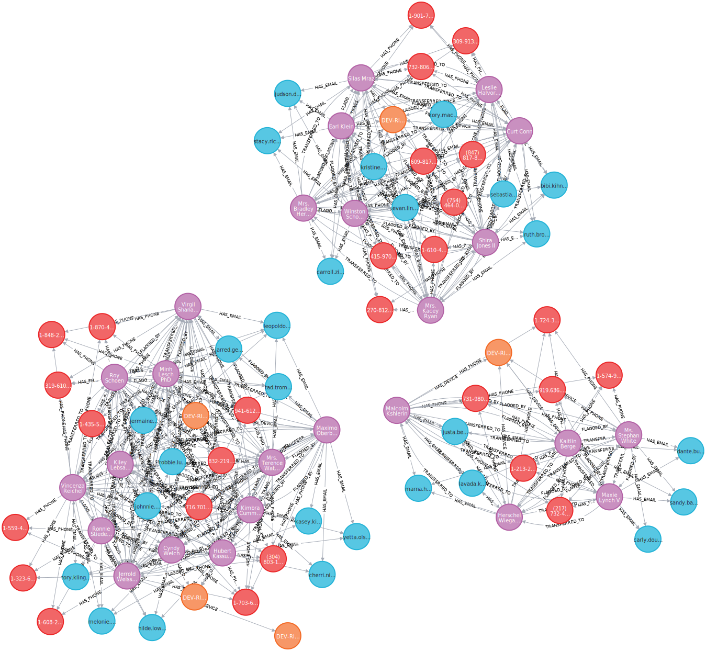

# RingNet

[](https://buffden.com)
[](https://github.com/buffden)
[](https://www.linkedin.com/in/harshwardhanpatil23)



Graph-based fraud ring detection using Neo4j. Models financial entities as a property graph to detect connected fraud networks through shared identifiers, behavioral patterns, and multi-hop traversal — a use case where graph databases outperform relational at scale.

---

## What This Project Is

RingNet demonstrates why **fraud ring detection is a graph problem**, not a SQL problem.

Fraud does not happen at the individual account level. It happens in *rings* — networks of accounts connected through shared phone numbers, emails, and devices. A single fraudster controls multiple accounts. Those accounts transact with each other and with legitimate victims. The connections — not the individual accounts — are where the fraud signal lives.

A relational database can model this, but finding a fraud ring at 3–4 hops requires recursive CTEs or self-joins that grow exponentially with hop depth. A property graph makes the same query a constant-complexity traversal — one Cypher statement regardless of ring size.

This project builds that system from scratch: synthetic data generation, Neo4j graph loading, progressive Cypher queries from basic traversal to composite risk scoring, and a system design ADR documenting the architectural decision.

---

## Graph Data Model

Understanding the schema before writing any code is essential. Every design decision here is intentional.

### Nodes (Entities)

| Label | Properties | Represents |
|---|---|---|
| `Account` | `id`, `name`, `created_at`, `fraud_confirmed` | A financial account |
| `Phone` | `number` | A phone number |
| `Email` | `address` | An email address |
| `Device` | `device_id`, `device_type` | A physical device (mobile/desktop) |
| `Address` | `street`, `city`, `zip`, `type` | A physical address |
| `Transaction` | `id`, `amount`, `timestamp`, `status` | A financial transaction |

### Relationships (Edges)

| Relationship | From → To | Properties | Meaning |
|---|---|---|---|
| `HAS_PHONE` | Account → Phone | `created_at` | Account registered this phone |
| `HAS_EMAIL` | Account → Email | `created_at` | Account registered this email |
| `HAS_DEVICE` | Account → Device | `last_seen` | Account logged in from this device |
| `HAS_ADDRESS` | Account → Address | — | Account associated with address |
| `TRANSFERRED_TO` | Account → Account | `amount`, `timestamp`, `transaction_id` | Direct money transfer |
| `SENT` | Account → Transaction | — | Account initiated this transaction |
| `TO` | Transaction → Account | — | Transaction credited to this account |
| `FLAGGED_BY` | Account → Account | `rule`, `confidence` | Fraud rule linked these accounts |


### Why These Modeling Decisions

**Shared identifiers are nodes, not properties.** A phone number could be a property on an Account (`account.phone = "+1-555-0101"`). But if it's a property, you cannot traverse it — you can only filter by it. Making Phone a node means two accounts sharing a phone number are literally connected in the graph. The connection *is* the fraud signal.

**Transactions are nodes, not just edges.** A transfer between accounts could be modeled purely as a `TRANSFERRED_TO` edge with amount and timestamp as properties. But making Transaction a node lets you attach multiple relationships to it — fraud rules, dispute records, review status — without denormalizing the edge.

**Relationships have direction.** `(Account)-[:HAS_PHONE]->(Phone)` not the reverse. Direction encodes the semantic: the account *owns* the phone, not the phone *belongs to* an account. In traversal queries, you often traverse in either direction using `-[:HAS_PHONE]-` (undirected), but explicit direction keeps the model semantically clean.

---

## Project Structure

```
ringnet/
│
├── docker-compose.yml              # Neo4j + APOC + GDS
├── .env.example                    # Credentials template — copy to .env before running
│
├── data/
│   └── raw/                        # Generated by GenerateData.java
│       ├── accounts.csv
│       ├── phones.csv
│       ├── emails.csv
│       ├── devices.csv
│       ├── addresses.csv
│       └── transactions.csv
│
├── src/main/java/ringnet/
│   ├── model/                      # Entity classes: Account, Phone, Transaction, etc.
│   ├── GenerateData.java           # Synthetic fraud dataset with rings
│   ├── LoadData.java               # CSV → Neo4j via Java driver
│   └── VerifyLoad.java             # Node/edge counts + ring existence check
│
├── pom.xml                         # Maven dependencies
│
├── queries/
│   ├── basic_traversal.cypher      # Single-hop: who shares a phone?
│   ├── shared_identifiers.cypher   # Multi-identifier overlap
│   ├── ring_detection.cypher       # N-hop fraud ring traversal
│   ├── velocity_checks.cypher      # High-frequency transactions in a time window
│   ├── risk_scoring.cypher         # Composite risk score per account
│   └── README.md                   # Query guide with goals and hints per query
│
├── system_design/
│   ├── ADR.md                      # Graph vs relational — decision record
│   ├── theory.md                   # Fraud concepts, graph fundamentals, detection techniques
│   └── sql_comparison.md           # Same query in SQL (recursive CTE) vs Cypher
│
└── README.md
```

---

## Tech Stack

| Tool | Version | Purpose |
| --- | --- | --- |
| Neo4j Community | 5.18 | Graph database |
| APOC Plugin | bundled | Extended Cypher procedures |
| Graph Data Science | bundled | PageRank, community detection, path algorithms |
| Java | 17+ | Data generation and loading scripts |
| Neo4j Java Driver | 5.18 | Connecting Java to Neo4j |
| java-faker | 1.0.2 | Synthetic data generation |
| dotenv-java | 3.0.0 | Loading credentials from `.env` file |
| Maven | 3.9+ | Build and dependency management |

---

## Setup

### Prerequisites

- Docker and Docker Compose installed
- Java 17+
- Maven 3.9+

### Configure credentials

```bash
cp .env.example .env
```

Edit `.env` and set `NEO4J_PASSWORD` to a password of your choice. The Java driver and Docker Compose both read from this file.

### Start Neo4j

```bash
docker compose up -d
```

Wait ~30 seconds for Neo4j to initialize, then open:

- **Browser UI:** <http://localhost:7474>
- **Bolt (driver):** `bolt://localhost:7687`
- **Credentials:** the `NEO4J_USER` / `NEO4J_PASSWORD` values from your `.env`

### Generate Data

```bash
mvn compile exec:java -Dexec.mainClass="ringnet.GenerateData"
```

This creates all CSVs in `data/raw/`. The dataset includes:

- 125 legitimate accounts in normal clusters
- 3 fraud rings of varying sizes (5, 8, and 12 accounts)
- Shared identifiers planted within each ring
- Transactions between ring members and legitimate accounts

### Load into Neo4j

```bash
mvn exec:java -Dexec.mainClass="ringnet.LoadData"
```

### Verify Load

```bash
mvn exec:java -Dexec.mainClass="ringnet.VerifyLoad"
```

Expected output:

```text
--- Node counts ---
  Account:        150
  Phone:           89
  Email:           94
  Device:          76
  Address:        112
  Transaction:    450

--- Relationship counts ---
  HAS_PHONE:           ...
  HAS_EMAIL:           ...
  HAS_DEVICE:          ...
  HAS_ADDRESS:        112
  SENT:               450
  TO:                 450
  TRANSFERRED_TO:     ...
  FLAGGED_BY:         ...

--- Fraud ring summary ---
Fraud rings detected: 3
Largest ring size:    12

--- Ring breakdown ---
  Ring 1: 5 accounts — [FRAUD-0001, ...]
  Ring 2: 8 accounts — [FRAUD-0006, ...]
  Ring 3: 12 accounts — [FRAUD-0014, ...]
```

---

## Running Queries

All queries live in `queries/`. Run them in the Neo4j browser (<http://localhost:7474>) or via `cypher-shell`:

```bash
docker exec -it ringnet-neo4j cypher-shell \
  -u "$NEO4J_USER" -p "$NEO4J_PASSWORD" \
  --file /var/lib/neo4j/import/queries/ring_detection.cypher
```

Work through queries in order — each builds on the previous.

---

## Query Progression

### 01 — Basic Traversal

Single hop. Who shares a phone number with whom?
This establishes Cypher syntax before adding complexity.

### 02 — Shared Identifiers

Multi-identifier check: accounts connected through phone OR email OR device.
Introduces `UNION` and multi-path patterns.

### 03 — Ring Detection ← The Core Query

Find all accounts reachable within N hops from a confirmed fraud account through any shared identifier.
This is the query that demonstrates graph's advantage over SQL.

### 04 — Velocity Checks

Accounts that made many transactions within a short time window.
Combines graph traversal with time-based filtering.

### 05 — Risk Scoring

Composite score per account based on:

- Hops from a confirmed fraud node
- Number of shared identifiers with flagged accounts
- Transaction velocity
- Ring membership

---

## System Design Context

The `system_design/` directory contains three documents that convert this hands-on project into interview-ready material.

**`ADR.md`** — Architectural Decision Record. Frames the core question: given fraud ring detection requirements, why choose a graph database over a relational one? Documents context, decision, alternatives considered, and consequences.

**`theory.md`** — Covers fraud concepts (account fraud, synthetic identity, money laundering), graph fundamentals (nodes, edges, paths, bipartite structure), Neo4j/Cypher mechanics, detection techniques, and the BFS algorithm used in ring detection.

**`sql_comparison.md`** — The same fraud ring query written in both SQL (recursive CTE) and Cypher, side by side. This is the most useful document for interviews — it makes the graph advantage concrete and measurable, not abstract.

---

## The Core Interview Argument

When asked to design a fraud detection system, the graph-first answer is:

> Fraud operates in rings — multiple accounts connected through shared identifiers like phone numbers, SSNs, or device fingerprints. This is a graph traversal problem. A relational database can model it, but finding a fraud ring at 3–4 hops requires recursive CTEs or self-joins that grow exponentially with hop depth. In a property graph, the same query is a constant-complexity traversal — one Cypher statement regardless of ring size. The connections between entities are first-class citizens in the data model, not derived at query time through joins.

This project exists to make that argument demonstrable, not just theoretical.

---

## Build Order for Contributors / Context for AI Assistants

If you are working on this project with an AI coding assistant, build in this sequence. Each step has a clear completion signal before moving to the next.

```text
Step 1   docker-compose.yml                  → Neo4j running at localhost:7474
Step 2   pom.xml                             → Maven build compiles cleanly
Step 3   GenerateData.java                   → CSVs present in data/raw/
Step 4   LoadData.java                       → Data visible in Neo4j browser
Step 5   VerifyLoad.java                     → Node/edge counts match expected
Step 6   queries/basic_traversal through risk_scoring → All queries return expected results
Step 7   system_design/ADR.md               → Decision documented
Step 8   system_design/sql_comparison.md    → SQL vs Cypher contrast written
Step 9   system_design/theory.md            → Fraud concepts and graph fundamentals documented
```

Do not skip verification steps. Each one catches modeling or loading errors before they compound.

---

## Learning Path

This project covers three distinct areas of system design knowledge:

- **Database choice** — when to reach for a graph database over a relational one, and how to defend that decision
- **End-to-end case study** — fraud detection as a full system design, from data model to query strategy
- **Design defense** — how to argue graph over relational when pushed back on cost, operational complexity, or team familiarity

The documents in `system_design/` are structured as interview artifacts — ADR, theory, and SQL vs Cypher comparison — not just notes.

---

## Graph Visualization

Run `queries/ring_detection.cypher` in the Neo4j browser to produce the visualization. The query returns full paths including the intermediate Phone, Email, and Device nodes that connect accounts:

```cypher
MATCH (a:Account {fraud_confirmed: true})-[r:HAS_PHONE|HAS_EMAIL|HAS_DEVICE]->(identifier)
RETURN a, r, identifier
```

This returns each fraud account and its direct connections to shared identifier nodes. The browser naturally reveals the ring structure — any Phone, Email, or Device node with multiple Account edges pointing to it is a shared identifier, and the accounts sharing it form a ring. The three distinct clusters correspond to the three rings planted by `GenerateData.java` with sizes 5, 8, and 12.

> The image above should be replaced by running the query after loading data. Open the Neo4j browser, run `ring_detection.cypher`, switch to graph view, and screenshot the result.

---

## Observations

Results from running the full pipeline: `GenerateData` → `LoadData` → `VerifyLoad` → all five Cypher queries.

### Data Generation (`GenerateData.java`)

```
Accounts: 150   Phones: 115   Emails: 120   Devices: 96   Addresses: 132   Transactions: 450   Rings: 3
```

150 accounts total: 125 legitimate + 25 fraud across 3 planted rings (sizes 5, 8, 12).

### Load Verification (`VerifyLoad.java`)

```
--- Node counts ---
  Account:        150
  Phone:          336
  Email:          360
  Device:         289
  Address:        528
  Transaction:    450

--- Relationship counts ---
  HAS_PHONE:           460
  HAS_EMAIL:           480
  HAS_DEVICE:          309
  HAS_ADDRESS:         528
  SENT:                450
  TO:                  450
  TRANSFERRED_TO:      402
  FLAGGED_BY:          100

--- Fraud ring summary ---
Fraud rings detected: 3
Largest ring size:    12

--- Ring breakdown ---
  Ring 1: 5 accounts  — [FRAUD-0001, FRAUD-0002, FRAUD-0003, FRAUD-0004, FRAUD-0005]
  Ring 2: 8 accounts  — [FRAUD-0006 … FRAUD-0013]
  Ring 3: 12 accounts — [FRAUD-0014 … FRAUD-0025]
```

`FLAGGED_BY` produced 100 edges — computed automatically from shared identifiers during load, requiring zero manual labeling.

### Query 01 — Basic Traversal

Every shared-phone pair returned has `fraud_confirmed = TRUE` on both sides. No legitimate account appears. The planted rings are self-contained: ring members share phones exclusively with other ring members.

### Query 02 — Shared Identifiers

All three identifier types (phone, email, device) surface the same 25 fraud accounts in distinct clusters. Ring 3 (12 accounts) produces the densest overlap — each member shares multiple identifiers with every other member, generating combinatorially more rows than Rings 1 and 2. No cross-ring connections appear, confirming the rings are structurally isolated from each other.

### Query 03 — Ring Detection

Fraud accounts each connect to 8 shared identifier nodes on average (Phone and Email each contributing 8 connections per account in Ring 3). The visual pattern in the Neo4j browser shows three discrete star-shaped clusters where identifier nodes sit at the center with multiple account edges pointing to them — a Phone or Email node with 5+ inbound `HAS_PHONE`/`HAS_EMAIL` edges is a direct visual fraud signal.

### Query 04 — Velocity Checks

All 20 accounts with more than 5 transactions are `fraud_confirmed = TRUE`. The top velocities:

| Account | Ring | Transactions |
|---|---|---|
| Modesto Dicki DVM | Ring 3 (12) | 15 |
| Elenore Boehm | Ring 3 (12) | 14 |
| Alejandro Pfannerstill | Ring 2 (8) | 13 |
| Miss Brendan Fahey | Ring 3 (12) | 12 |
| Wallace Morar | Ring 3 (12) | 12 |

Ring 3 dominates the top of the velocity list. No legitimate account exceeded the threshold of 5 transactions in this dataset, making transaction velocity a clean discriminator here.

### Query 05 — Risk Scoring

The composite score `(fraud_neighbors × 10) + (shared_id_count × 3) + (tx_count × 1)` stratifies all three rings perfectly by membership size:

| Ring | Size | Score range | fraud_neighbors |
|---|---|---|---|
| Ring 3 | 12 | 151 – 168 | 12 |
| Ring 2 | 8 | 106 – 114 | 8 |
| Ring 1 | 5 | 69 – 73 | 5 |

All 25 fraud accounts surface in the top 25 results. No legitimate account appears. The `fraud_neighbors` signal (ring proximity weighted at ×10) dominates the score — a direct consequence of the graph traversal finding all confirmed fraud nodes reachable within 6 hops.

### Key Takeaway

The graph model makes fraud rings structurally visible without any ML model. Shared identifier nodes with multiple inbound account edges are the fraud signal. Multi-hop traversal to confirmed fraud nodes assigns proximity scores. Both are single Cypher statements — no recursive joins, no self-referential SQL, no exponential blowup with ring depth.

---

## References

- [Neo4j Fraud Detection Use Cases](https://neo4j.com/use-cases/fraud-detection/)
- [Designing Data-Intensive Applications — Chapter 2](https://dataintensive.net/) — Graph-like Data Models
- [Neo4j Cypher Manual](https://neo4j.com/docs/cypher-manual/current/)
- [Graph Data Science Library](https://neo4j.com/docs/graph-data-science/current/)

---

## Inspiration

This project was directly inspired by *Designing Data-Intensive Applications* by Martin Kleppmann. Chapter 2's section on graph-like data models made the case for property graphs so clearly — and the fraud ring use case clicked so naturally — that building this out felt like the right way to internalize it. If you're working through DDIA and want a hands-on project to go alongside Chapter 2, this is it.
